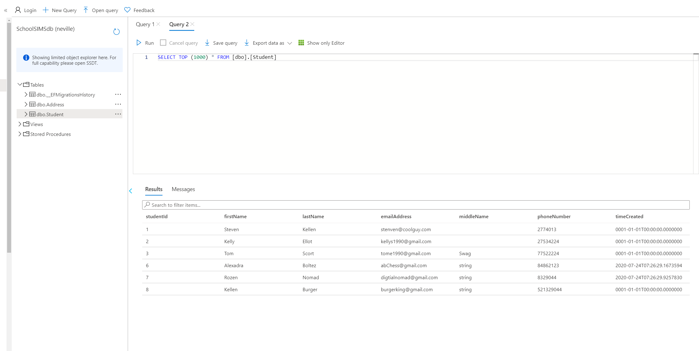
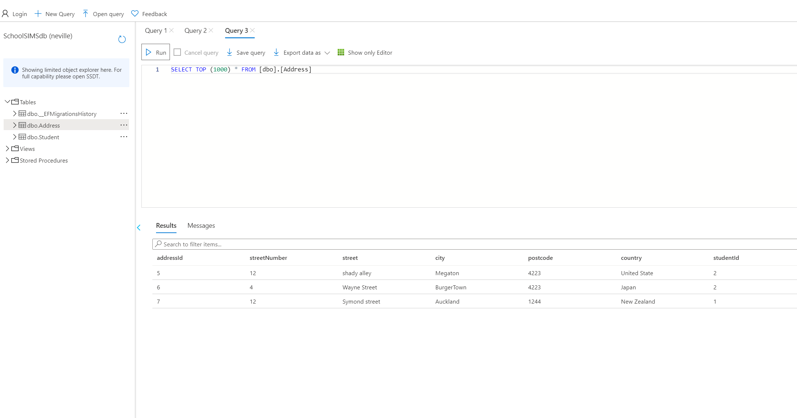
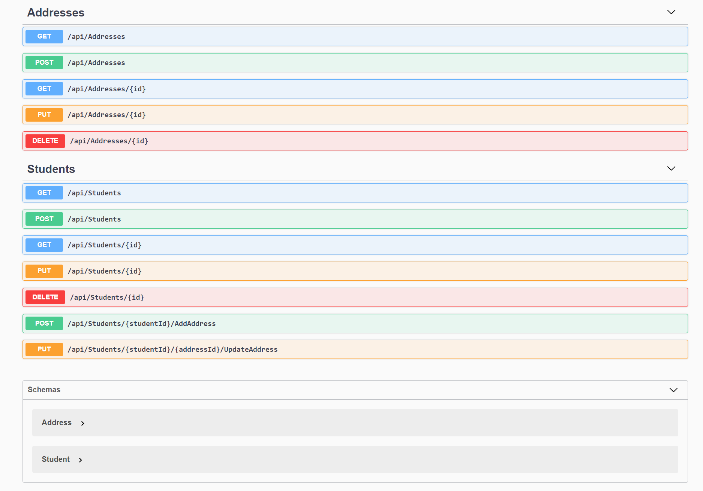

# Introduction
This project is developed for the event of Microsoft Student Accelerator New Zealand
2020 Phase 1. A backend is developed and deployed using Microsoft Azure Services.
The API is created using code first method to generate database and controller.
The model demonstrate a one to many relationship of data query and model.
The core function included login, create user, and relational databalse.

All endpoint controller is shown using Swagger. Please see link below


API Endpoints with Azure SQL Database Server Link:  
http://neville-msa-phase1.azurewebsites.net/index.html

The application is build by using EntityFrameworkCore and ASP.NET Core.

### Documentation
  * SQL database
    * Student Example Instances
    * Address Example Instances
    * All API Endpoints
  * Note
    * Student Model
    * Address Model

## SQL database
The following are some demonstration of the database table from the API, where
one students can have multiple address and one address only belong to one student.

### Student Example Instances

### Address Example Instances  

### ALL API Endpoints



## Note
### Student Model
The following are the model used in the database.
```
public class Student
    {
        [Key]
        [DatabaseGenerated(DatabaseGeneratedOption.Identity)]
        public int studentId { get; set; }
        [Required, MaxLength(100)]
        public string firstName { get; set; }
        public string middleName { get; set; }
        [Required]
        public string lastName { get; set; }
        public string emailAddress { get; set; }
        public int phoneNumber { get; set; }
        public DateTime timeCreated { get; set; }

        [JsonIgnore]
        public List<Address> addresses { get; set; }
    }
```
The student have reference to a list of address which demonstrated the one-to-many
relationship with addresses. Student have a primary key of studentID.

### Address
```
public class Address
    {
        [Key]
        [DatabaseGenerated(DatabaseGeneratedOption.Identity)]
        public int addressId { get; set; }
        public int streetNumber { get; set; }
        public string street { get; set; }
        public string city { get; set; }
        public int postcode { get; set; }
        public string country { get; set; }

        public int studentId { get; set; }
        [JsonIgnore]
        public Student student { get; set; }
    }
```
The address hold student ID as foreign key and addressId as primary key. 


### Endpoint controller
The controller are generated by the database context file studentContext using Microsoft.Entity.FrameworkCore.Tools, which
contains the basic CRUD operation for both address and student model. A further two operations is added to student controller
for changing address and adding address for student.


### Deployment using Microsoft Azure
The deployment is done with Microsoft Azure Services, Swagger is added to the
application to demonstrate CRUD operations.
